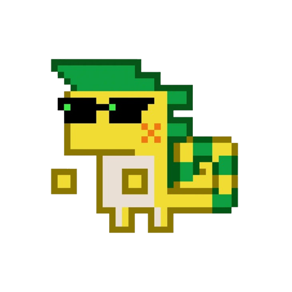

一个基于 Electron 的桌面宠物应用，支持拖拽、自动移动、互动表情等功能。

## 功能特色

- 桌宠可自由拖动，自动在桌面上移动
- 撞墙时会显示不同的表情（如生气、哭泣）
- 拖动时有气泡提示和挥手动画
- 支持多种宠物表情和动作（见 images 文件夹）

## 目录结构

```
├── images/                # 宠物表情与动作图片
├── src/
│   ├── index.html         # 主页面
│   ├── main.js            # Electron 主进程
│   ├── pet.js             # 宠物行为逻辑
│   ├── preload.js         # 预加载脚本，主渲染通信
│   └── style.css          # 样式表
├── package.json           # 项目配置
└── .gitignore
```

## 安装与运行

1. 安装依赖

   ```sh
   npm install
   ```

2. 启动桌宠

   ```sh
   npx electron .
   ```

   或

   ```sh
   npm start
   ```

## 开发说明

- 主进程入口：src/main.js
- 渲染进程逻辑：src/pet.js
- 资源图片存放于 images 文件夹

## 依赖

- [Electron](https://www.electronjs.org/) ^36.3.2

## 预览


欢迎二次开发与自定义表情！
